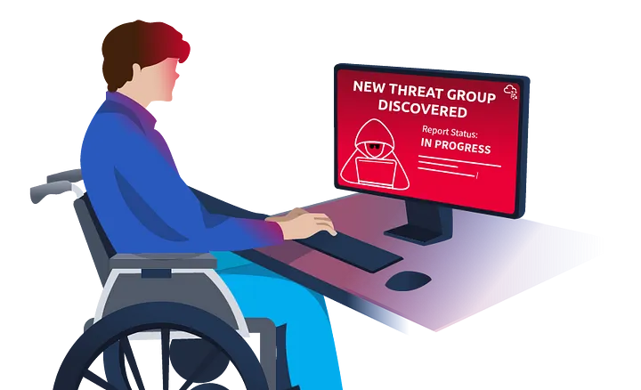
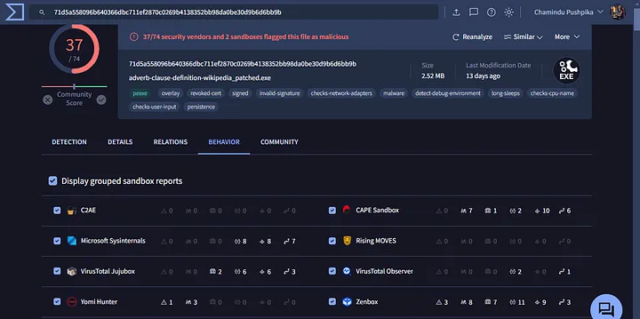
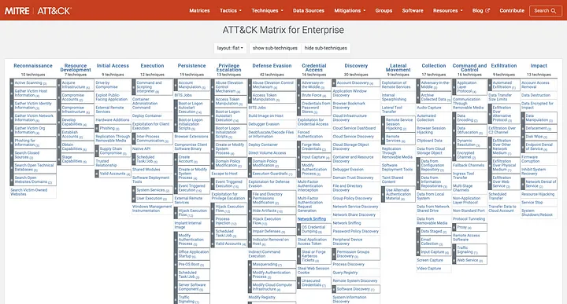

# 🕵️‍♂️ THM Threat Intelligence Tools – Blue Team Lab

 <!-- Replace this with a cover image -->

---

## 📘 Introduction

This project explores the use of open-source intelligence (OSINT) tools and threat feeds to identify Indicators of Compromise (IOCs), analyze suspicious activity, and simulate blue team analysis. The lab is based on TryHackMe’s Threat Intelligence modules and focuses on real-world detection practices used by Tier 1 SOC analysts.

---

## 🎯 Objectives

- Utilize open-source threat intelligence platforms to investigate IOCs
- Correlate data with MITRE ATT&CK tactics and techniques
- Simulate threat detection and reporting workflows
- Practice analyzing malicious IPs, hashes, and domains

---

## 🧰 Tools & Platforms Used

| Tool/Platform        | Purpose                                    |
|----------------------|--------------------------------------------|
| VirusTotal           | Analyze file hashes, IPs, and domains      |
| AbuseIPDB            | Reputation analysis of suspicious IPs      |
| Maltrail             | Local traffic analysis and threat detection|
| MITRE ATT&CK         | Threat behavior classification framework   |
| TryHackMe            | Lab hosting and scenario simulations       |

---

## 🧪 Lab Walkthrough

### ✅ Step 1: Identify and Investigate IOCs

Start with provided logs or traffic captures. Extract:

- Suspicious IPs
- File hashes
- URLs or domains

Investigate them using OSINT tools:

```plaintext
https://www.virustotal.com/gui/home/search
https://www.abuseipdb.com/
```

Search each IOC and record:

- Detection ratio
- Behavior tags (e.g., phishing, malware, RAT)
- Geographic origin
- Known campaigns or malware families

---

### ✅ Step 2: Map Behavior to MITRE ATT&CK

1. Use the IOC data to understand TTPs (Tactics, Techniques, and Procedures).
2. Match behaviors to MITRE ATT&CK framework:
   - Initial Access: Spearphishing Link
   - Execution: Malicious Script
   - Persistence: Registry Run Key

Example lookup:  
```plaintext
https://attack.mitre.org/techniques/T1059/
```

---

### ✅ Step 3: Simulate Threat Reporting

Create a summary report with:

- Type of threat
- How it was detected
- Threat actor if known
- MITRE ATT&CK ID
- Suggested response or mitigation

This practice reinforces blue team documentation and escalation workflows.

---

## 📸 Screenshots

| Description                  | Screenshot Placeholder            |
|------------------------------|-----------------------------------|
| IOC Lookup in VirusTotal     |  |
| AbuseIPDB Threat Score       |   |
| MITRE ATT&CK Mapping         |       |

> Add screenshots above after uploading them to your `images/` folder.

---

## ✅ Key Takeaways

- 🔍 Practiced IOC research using real tools  
- 🛡️ Mapped threats to ATT&CK framework for triage  
- 🧠 Strengthened skills in threat detection and reporting  
- 🧾 Reinforced the structure of SOC investigation workflows  

---

## 📎 References

- [TryHackMe: Threat Intelligence Modules](https://tryhackme.com/)
- [VirusTotal](https://www.virustotal.com/)
- [AbuseIPDB](https://www.abuseipdb.com/)
- [MITRE ATT&CK](https://attack.mitre.org/)

---

## 📬 About Me

👋 I'm **Zee**, a cybersecurity analyst building blue team experience through hands-on simulations and defensive labs. These labs help sharpen my detection and triage skills while working with industry-standard tools.

🔗 [Connect with me on LinkedIn](https://www.linkedin.com/in/zee-williams)  
🔍 [More projects at GitHub](https://github.com/zeewilliams)
```
